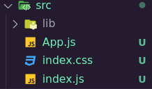
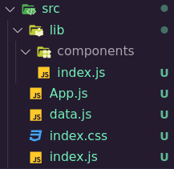
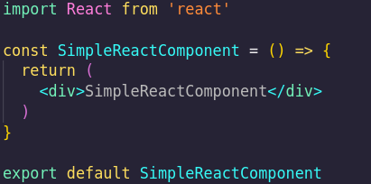

# ReactWorkshop

Welcome to our React workshop. If you have already worked with React, you certainly have used libraries before.
The goal of this workshop is to create a short npm package, so-called a library.
At the end, you should be able to import your components in any react project.

This library will export 4 components that you will build during this workshop.
Because the goal of this workshop is not to learn React, we will help you with the basics.

# Requirements

Before starting the workshop, you will need to install a few things.

### Install Node:

```shell
sudo dnf install nodejs
```

### Install Node Package Manager:

```shell
sudo dnf install npm
```

### Create an account on npm:

Go to [npm main page](https://www.npmjs.com/) and create an account.

Run this command and follow the instructions:

```shell
npm login
```

## Step 0 : Structure of the workshop

To start the workshop, create a vite / react application by running:
```shell
npm create vite@latest
```

After that,
```shell
cd <name-of-your-app>
```

In the `src` folder create a new directory called `lib`.

It should look like this:


Run `npm run dev`, and click on the link in the terminal to see your app.
In the lib folder, create a `index.js` file, as well as a folder called `components`.
In the `components` folder, create four files called `CustomTooltip.jsx`, `CustomDropdown.jsx`, `CustomModal.jsx`, `CustomSlidingList.jsx` they will be all of the components we will export at the end of the workshop.

Your `src` folder should look like this:


## Step 1 : Custom Tooltip component

In the `CustomTooltip.jsx` file, create a basic react component (use `racfe` from 'ES7+ React/Redux/React-Native snippets' VScode extension to go faster).

Here is a simple example of a component in react:

Of course, name it after the file your are in.

Now modify your component in order for it to take a string called `message` as parameter.
In your component, display the message passed as parameter when you hover a specific button.
Style is up to you !

## Step 2 : Custom Dropdown component

In the `CustomDropdown.jsx` file, create a basic react component (use `racfe` from 'ES7+ React/Redux/React-Native snippets' VScode extension to go faster).

Now modify your component in order for it to take a list called `titles` as parameter.
In your component, map over the titles object to get a list of the titles you can have.
A good use to this could be to navigate to a path, but because it is not the purpose of the workshop, just print the value you clicked.
During styling, remember that your titles should only be visible if you hover your component.

## Step 3 : Custom Modal component

In the `CustomModal.jsx` file, create a basic react component (use `racfe` from 'ES7+ React/Redux/React-Native snippets' VScode extension to go faster).

Now modify your component in order for it to take two strings called `message` and `color` as parameter.
In your component, display the message when a button is trigered, in the given color.
A good use to this could be to indicate a sucessful login or an error.
Once again, styling is up to you !

## Step 4 : Custom SlidingList component

In the `CustomSlidingList.jsx` file, create a basic react component (use `racfe` from 'ES7+ React/Redux/React-Native snippets' VScode extension to go faster).

Now modify your component in order for it to take a list called `items` as parameter.
In your component, map over your items to get them individualy.
A good use to this component could be to show off your projects in a portfolio.
For the style, feel free to discover new things, you can manually slide the children, or do it automatically with setTimeout().

## Step 5: Testing and before going further

In the `index.js` file, export all your components.
In your `App.js` file, import your new components in order to use them.
In the main div of your App component, call all of your components passing fake arguments as parameter.
Save the changes to refresh your application !

## Step 6 : The library

To be able to create your library, run the following commands:

```shell
npm install --save-dev @babel/core @babel/cli @babel/preset-env @babel/preset-react

npm install -save @babel/polyfill
```

In your source folder, create a `babel.config.json` and copy these lines:

```json
{
 "presets": [
  [
   "@babel/env",
    {
     "targets": {
     "edge": "17",
     "firefox": "60",
     "chrome": "67",
     "safari": "11.1"
      },
   "useBuiltIns": "usage",
   "corejs": "3.6.5"
    }
],
   "@babel/preset-react"
]
}
```

In `package.json`, under scripts, replace the build script with the following:

```json
"build": "rm -rf dist && NODE_ENV=production babel src/lib --out-dir dist --copy-files"
```

Now run this command, it will generate a `dist` folder containing your future library:

```shell
npm run build
```

Now you will need to modify the `package.json` in order to publish your library.
Modify it with your own modifications. Here is an example of mine:

```json
{
  "name": "custom-npm-package-epitech-workshop",
  "description": "Four test React components",
  "author": "EPITECH",
  "keywords": ["react", "components", "ui", "epitech", "workshop"],
  "version": "0.1.0",
  "private": false,
  "main": "dist/index.js",
  "module": "dist/index.js",
  "files": [ "dist", "README.md" ]
}
```

You can finally run

```shell
npm publish
```

If you followed the instructions I gave you, in any other React application, you will be able to run the command bellow and access your components everywhere.

```shell
npm install <the-name-of-your-library>
```

## Bonus

If you finished all the steps above, you can try to make a nice and usefull library than you will be able to use in all your future projects. Think of adding usefull props to your components and more...

### Thank you for your participation to this workshop !
